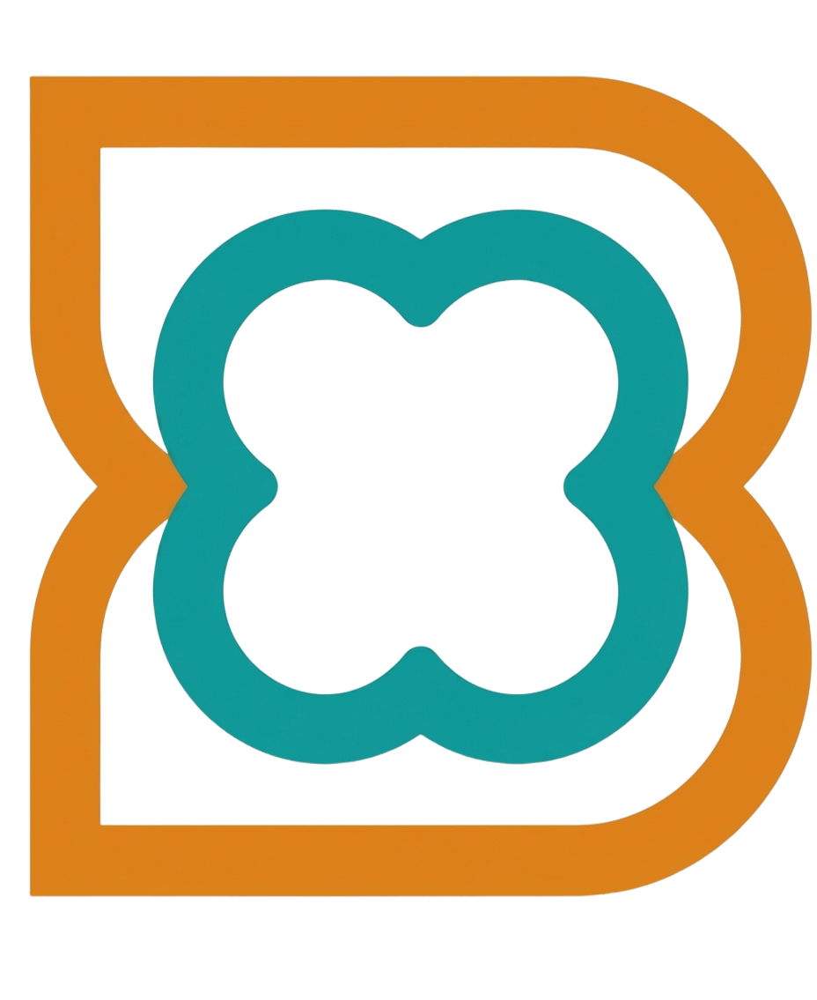
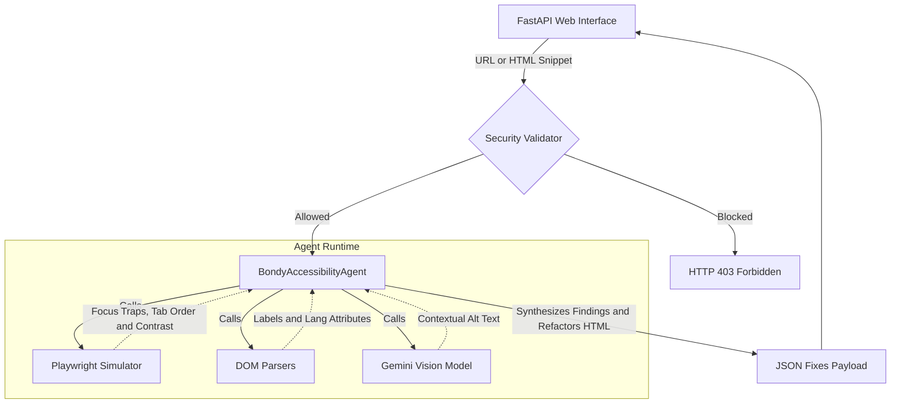

<div align="center">
  
  <h1>Bondy</h1>
  <p><strong>An autonomous, agentic Web Accessibility Auditor built on Google ADK 2.0.</strong></p>
</div>

Bondy leverages large language models and deterministic Playwright routines to scan web applications, identify accessibility violations (WCAG 2.2 AA), and autonomously suggest exact code fixes.

---

## Table of Contents
- [The Problem](#the-problem)
- [The Solution](#the-solution)
- [Features](#features)
- [Architecture & Workflow](#architecture--workflow)
- [Quick Start](#quick-start)
- [Testing & Linting](#testing--linting)
- [Security](#security)
- [Contributors](#contributors)
- [References](#references)

---

## The Problem

According to the WebAIM Million report, **95.9% of home pages presented detectable WCAG 2 failures**, reversing the trend of small improvements observed over the previous six years (WebAIM, 2026). This reversal and stagnation in web accessibility may be heavily exacerbated by the rapid proliferation of AI-assisted coding tools. While developers increasingly rely on Large Language Models (LLMs) to generate web applications, these models often produce boilerplate HTML that lacks proper semantic structure and fails to adhere to modern accessibility standards.

Manual web accessibility audits are resource-intensive, slow, and expensive. Static code analyzers (like Lighthouse) only check for the presence of HTML attributes but cannot evaluate their semantic quality or catch dynamic interaction bugs. 

Strikingly, **96% of all detected errors fall into just six categories**:
1. Low contrast text (83.9%)
2. Missing alternative text for images (53.1%)
3. Missing form input labels (51%)
4. Empty links (46.3%)
5. Empty buttons (30.6%)
6. Missing document language (13.5%)

Fixing just these issues would significantly improve web accessibility globally.

## The Solution

**Bondy** bridges the critical gap between passive static linters and expensive human auditors. While tools like Google Lighthouse simply parse source code to check if an `alt` attribute exists, they fail to understand if the image is merely decorative or if the provided text actually makes sense. 

Bondy introduces a paradigm shift by combining **deterministic browser automation (Playwright)** with the **cognitive reasoning of Large Language Models (Gemini Multimodal)**. 

Unlike traditional tools, Bondy:
1. **Navigates like a human**: It physically tabs through the DOM using Playwright to detect invisible focus traps and illogical tab sequences.
2. **Sees like a human**: It uses Gemini's Multimodal Vision to look at the rendered web page, deciding if an image is purely decorative (requiring an empty `alt=""`) or analyzing if the current description matches the visual context.
3. **Acts like an engineer**: Once it finds the errors that plague 96% of the web, it doesn't just output a warning, it acts as an autonomous refactoring agent, generating the exact, drop-in HTML patch needed to resolve the WCAG violation.

## Features

- **Autonomous Agent Workflow**: A monolithic AI Agent orchestrator (`BondyAccessibilityAgent`) equipped with a rich `SkillToolset` to sequentially evaluate inputs and bypass strict API rate limits.
- **Single-Pass Modal Auditing**: Audits and generates complete, generic, and reusable modal accessibility fixes (logical DOM order, role/aria attributes, close buttons, robust focus traps, Escape handlers, background inertness, and focus restoration) in the very first scan.
- **Playwright Computed Contrast**: Uses a Playwright Chromium headless instance to render the page and extract exact Computed Styles for foreground/background colors, ensuring deterministic and flawless WCAG 1.4.3 contrast ratio calculations without relying on AI mathematical estimations.
- **Robust JSON Parsing Engine**: Features a fault-tolerant JSON extraction system capable of parsing clean payloads out of arbitrary markdown code blocks and conversational commentary returned by the model.
- **Deterministic Skills**: 6 highly specialized, deterministic accessibility skills that execute locally via Playwright (e.g., focus trap detection, HTML lang validation).
- **Security Guardrails**: Strict input validation to ensure only authorized local environments or raw HTML snippets are scanned.
- **Enterprise-Ready AI**: Runs robustly using Google Cloud Vertex AI, ensuring high availability and bypassing the limitations of free-tier API keys.

## Architecture & Workflow

To circumvent rate limits while maintaining high performance, Bondy uses a single, monolithic `BondyAccessibilityAgent` equipped with 9 specialized skills (`SkillToolset`). This single agent handles the full lifecycle of reading files, validating criteria, and returning a JSON payload of fixes.



### Skill Mapping

| Category | Associated Skill | Skill Type | Responsibility | WCAG Criterion |
| :--- | :--- | :--- | :--- | :--- |
| **Image Auditing** | `alt-text-quality-analyzer` | Gemini Multimodal Vision | Analyzes image context against alt text | 1.1.1 (Non-text Content) |
| | `image-decorator-classifier` | Gemini Multimodal Vision | Classifies if an image is purely decorative | 1.1.1 (Non-text Content) |
| **Form Auditing** | `form-labels-validator` | Deterministic (DOM Parsing) | Audits missing associations in input tags | 1.3.1 / 4.1.2 (Labels) |
| **Keyboard Auditing**| `focus-order-validator` | Playwright Simulation | Detects illogical focus orders and jumps | 2.4.3 (Focus Order) |
| | `focus-trap-detector` | Playwright Simulation | Detects keyboard focus traps in components | 2.1.2 (No Focus Trap) |
| **Document Auditing** | `document-language-validator`| Deterministic (DOM Parsing) | Validates root `<html>` lang attribute | 3.1.1 (Language of Page) |
| | `text-contrast-calculator` | Playwright Simulation (Computed Styles) | Calculates text contrast mathematically against rendered backgrounds | 1.4.3 (Contrast) |
| | `interactive-elements-validator`| Deterministic (DOM Parsing) | Identifies empty links or button tags | 2.4.4 / 4.1.2 (Name/Role) |
| **Refactoring** | `suggestion-fix-generator` | Gemini Text Refactoring | Generates clean HTML replacement code | N/A |

## Quick Start

### 1. Prerequisites
- Python 3.12+
- `uv` (Python Package Manager)
- A Google Cloud Project with Vertex AI enabled.

### 2. Installation & Credentials Setup
1. Clone the repository and sync dependencies:
   * **Windows / macOS / Linux**:
     ```bash
     uv sync
     ```
2. Install Playwright browsers (required for deterministic visual/focus skills):
   * **Windows / macOS / Linux**:
     ```bash
     uv run playwright install --with-deps chromium
     ```
3. Create a Google Cloud Project (if you don't have one):
   - Go to the [Google Cloud Console (console.cloud.google.com)](https://console.cloud.google.com/).
   - Create a new project and copy its **Project ID**.
   - Make sure to enable the **Vertex AI API** in the APIs & Services section for that project.
4. Authenticate with Google Cloud locally since this project routes traffic globally to handle rate limits:
   * **Windows / macOS / Linux**:
     ```bash
     gcloud auth application-default login
     gcloud auth application-default set-quota-project your-google-cloud-project-id
     ```
5. Configure your local environment variables. You can create a `.env` file in the root directory (copy `.env.example`):
   ```env
   # Force ADK to use Vertex AI instead of standard Gemini API
   GOOGLE_GENAI_USE_VERTEXAI=True
   
   # Replace with your own Google Cloud Project ID that has the Vertex AI API enabled
   GOOGLE_CLOUD_PROJECT=your-google-cloud-project-id
   GOOGLE_CLOUD_LOCATION=global
   ```
   *Alternatively, if you prefer running temporary exports in your terminal:*
   * **Windows (PowerShell)**:
     ```powershell
     $env:GOOGLE_GENAI_USE_VERTEXAI="True"
     $env:GOOGLE_CLOUD_PROJECT="your-google-cloud-project-id"
     ```
   * **macOS / Linux (Bash/Zsh)**:
     ```bash
     export GOOGLE_GENAI_USE_VERTEXAI="True"
     export GOOGLE_CLOUD_PROJECT="your-google-cloud-project-id"
     ```

### 3. Run the API and Web UI Locally
Launch the built-in FastAPI server to access the Bondy Web UI:
* **Windows / macOS / Linux**:
  ```bash
  uv run python -m uvicorn app.fast_api_app:app --reload --port 8080
  ```
  Go to `http://localhost:8080` to interact with the agent.

### 4. Deployment to Google Cloud (Optional)
Bondy can be fully deployed to your own Google Cloud environment (Cloud Run) using the ADK `agents-cli`:

1. Provision the base infrastructure (Terraform):
   * **Windows / macOS / Linux**:
     ```bash
     agents-cli infra single-project
     ```
2. Build and deploy the Dockerized application to Cloud Run:
   * **Windows / macOS / Linux**:
     ```bash
     agents-cli deploy
     ```

### 5. Auditing Local Files (Usage)
Bondy supports auditing local files seamlessly. To scan a local project:
1. Drop your HTML files or folders into the local `demo_sites/` directory within this repository.
2. Open the Bondy Web UI (`http://localhost:8080`).
3. In the URL bar of the UI, simply type the path to your file relative to the demo folder (e.g., `demo_sites/my_folder/index.html` or just `demo_sites/my_folder`).
4. Bondy will read your local HTML, launch a headless browser to evaluate computed styles and interactions, and autonomously generate a JSON fix.

## Testing & Linting

### Running Tests
We use `pytest` for all unit and integration testing.
* **Windows / macOS / Linux**:
  ```bash
  uv run pytest
  ```

### Code Formatting & Pre-Commit
Verify code compliance with formatters and linters:
* **Windows / macOS / Linux**:
  ```bash
  uv run pre-commit run --all-files
  ```

### Metadata and Manifest Validation
Validate agent configurations, types, and manifests:
* **Windows / macOS / Linux**:
  ```bash
  agents-cli lint
  ```

## Security

All tools strictly adhere to the project's security rules (`AGENTS.md`), preventing directory traversal outside of the `ALLOWED_SOURCES` and restricting browser navigation.

## Contributors

<table>
  <tr>
    <td align="center">
      <a href="https://github.com/EvePulido">
        <br />
        <sub><b>EvePulido</b></sub>
      </a>
    </td>
    <td align="center">
      <a href="https://github.com/1mano1">
        <br />
        <sub><b>1mano1</b></sub>
      </a>
    </td>
  </tr>
</table>

## References

WebAIM. (2026). *The WebAIM million: An annual accessibility analysis of the top 1,000,000 home pages*. Center for Persons with Disabilities, Utah State University. https://webaim.org/projects/million/

Demo site templates provided by [freewebsitetemplates.com](https://freewebsitetemplates.com) (used for accessibility auditing test environments).

---
*Built using the Google Agent Development Kit.*
