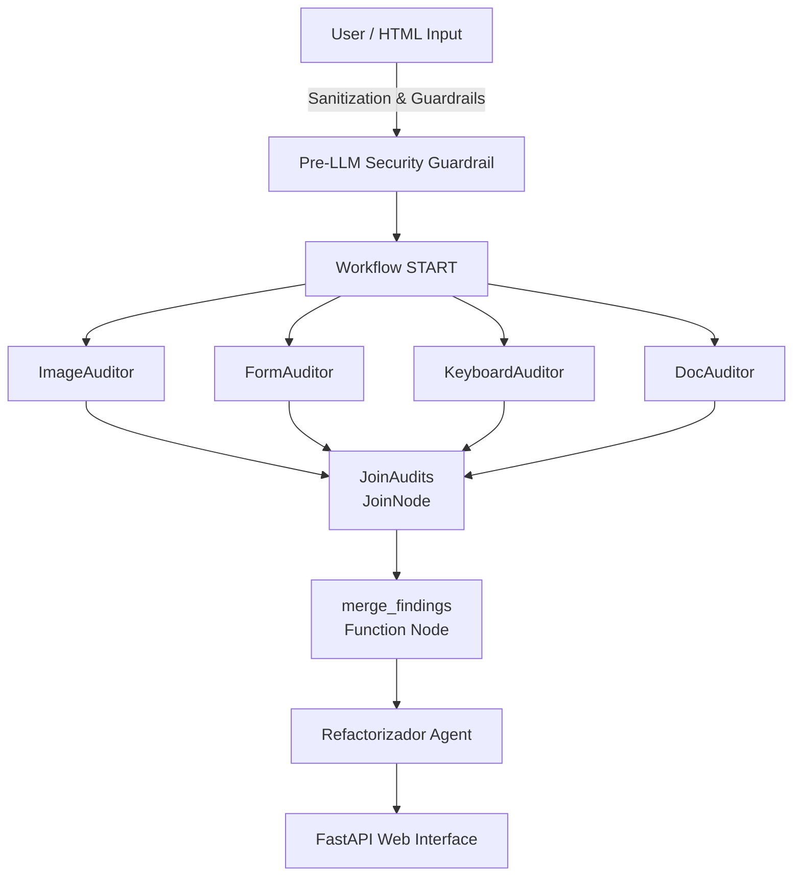

# Bondy ♿🛡️

**Bondy** is an autonomous, agentic Web Accessibility Auditor built on **Google ADK 2.0**. It leverages large language models and deterministic Playwright routines to scan web applications, identify accessibility violations (WCAG 2.2 AA), and autonomously suggest exact code fixes.

## 🚀 Features

- **Autonomous Agent Workflow**: A multi-agent concurrent architecture featuring specialized subagents (Image, Form, Keyboard, and Document Structure) synchronized via ADK 2.0 Workflows.
- **Deterministic Skills**: 6 highly specialized, deterministic accessibility skills that execute locally via Playwright (e.g., Focus Trap Detection, Contrast Calculation).
- **Security Guardrails**: Input validation to ensure only authorized local environments or raw HTML are scanned.
- **Local-First AI**: Runs flawlessly using Google AI Studio API Keys (`gemini-flash-latest`), perfect for local deployments without complex GCP architectures.

## 📁 Architecture & Workflow

Bondy uses a multi-agent concurrent architecture where four specialized auditor agents run in parallel to scan the page, synchronize their findings at a join node, and pass them to a refactoring agent.



### Subagent and Skill Mapping

| Agent | Associated Skill | Skill Type | Responsibility | WCAG Criterion |
| :--- | :--- | :--- | :--- | :--- |
| **`ImageAuditor`** | `alt-text-quality-analyzer` | Gemini Multimodal Vision | Analyzes image context against alt text | 1.1.1 (Non-text Content) |
| | `image-decorator-classifier` | Gemini Multimodal Vision | Classifies if an image is purely decorative | 1.1.1 (Non-text Content) |
| **`FormAuditor`** | `form-labels-validator` | Deterministic (DOM Parsing) | Audits missing associations in input tags | 1.3.1 / 4.1.2 (Labels) |
| **`KeyboardAuditor`**| `focus-order-validator` | Playwright Simulation | Detects illogical focus orders and jumps | 2.4.3 (Focus Order) |
| | `focus-trap-detector` | Playwright Simulation | Detects keyboard focus traps in components | 2.1.2 (No Focus Trap) |
| **`DocAuditor`** | `document-language-validator`| Deterministic (DOM Parsing) | Validates root `<html>` lang attribute | 3.1.1 (Language of Page) |
| | `text-contrast-calculator` | Mathematical Formula | Calculates text contrast against backgrounds | 1.4.3 (Contrast) |
| | `interactive-elements-validator`| Deterministic (DOM Parsing) | Identifies empty links or button tags | 2.4.4 / 4.1.2 (Name/Role) |
| **`Refactorizador`** | `suggestion-fix-generator` | Gemini Text Refactoring | Generates clean HTML replacement code | N/A |

## 🛠️ Quick Start

### 1. Prerequisites
- Python 3.12+
- `uv` (Python Package Manager)
- A Google AI Studio API Key.

### 2. Installation & Credentials Setup
1. Clone the repository and sync dependencies:
   ```bash
   uv sync
   ```
2. Install Playwright browsers (required for deterministic visual/focus skills):
   ```bash
   uv run playwright install --with-deps chromium
   ```
3. Create a `.env` file in the root directory of the project and paste your Gemini API Key. To prevent conflicts with any expired or invalid environment variables configured globally on your local machine, **set both variables to the same key**:
   ```env
   GEMINI_API_KEY=tu_api_key_de_ai_studio
   GOOGLE_API_KEY=tu_api_key_de_ai_studio
   ```

### 3. Run the API and Web UI
Launch the built-in FastAPI server to access the Bondy Web UI:
   ```bash
   uv run python -m uvicorn app.fast_api_app:app --reload
   ```
   Go to `http://localhost:8000/bondy` to interact with the agent.


## 🧪 Testing

We use `pytest` for all unit and integration testing. Due to quota limitations on free API keys, integration tests use a simulated (Mock) LLM response.

```bash
uv run pytest tests/unit tests/integration
```

## 🔒 Security

All tools strictly adhere to the project's security rules (`AGENTS.md`), preventing unauthorized web navigation and blocking directory traversal outside of the `ALLOWED_SOURCES`.

---
*Built with ❤️ using the Google Agent Development Kit.*
