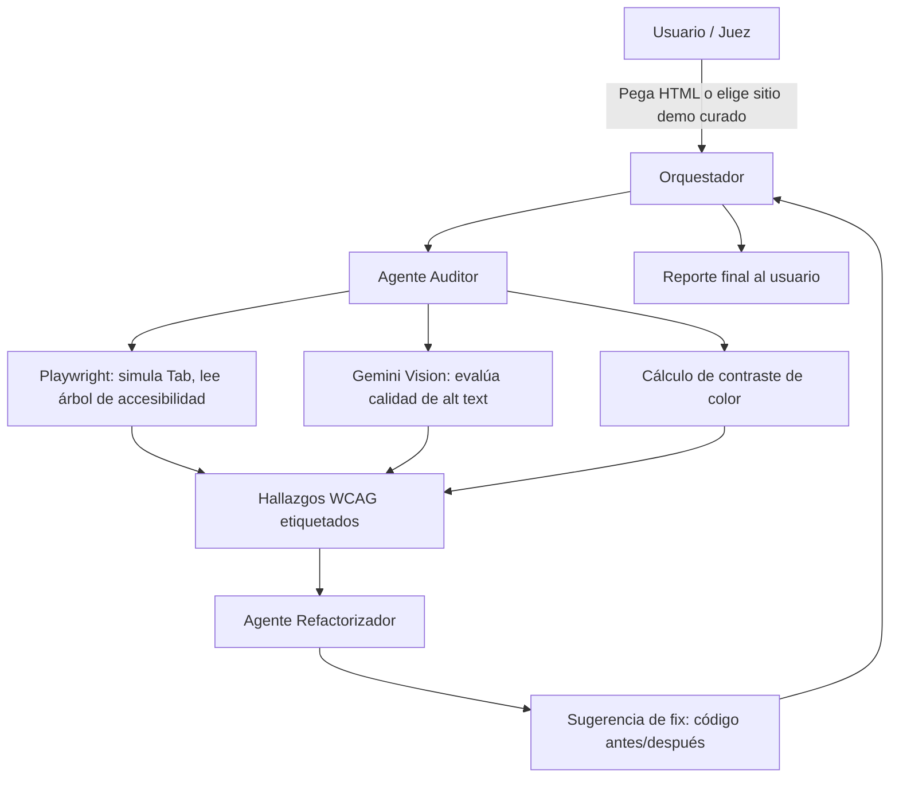

# A11y-Forge — Especificación del Proyecto (v2)

> Auditor de accesibilidad multiagente que no solo detecta SI existen atributos de accesibilidad, sino SI son correctos.

---

## Resumen Ejecutivo

| | |
|---|---|
| **Track recomendado** | Agents for Business (decidido) — narrativa de costo/cumplimiento (demandas ADA). Agents for Good queda como alternativa si el video sale mejor con el ángulo humano |
| **One-liner** | Un Auditor + Refactorizador que combina simulación de navegación por teclado, cálculo de contraste y visión por computadora para encontrar problemas de accesibilidad que los linters estáticos (axe-core, Lighthouse) no detectan |
| **Diferenciador clave** | No solo "¿existe el alt text?" sino "¿el alt text describe lo que de verdad muestra la imagen?" |

---

## 1. El Problema

Las auditorías manuales de WCAG 2.1/2.2 son lentas. Los escáneres estáticos verifican presencia de atributos (¿hay `alt`? ¿hay `aria-label`?) pero no su **calidad** ni el comportamiento **dinámico** de la página (orden real de foco al navegar con Tab, trampas de teclado). Eso deja pasar problemas reales que sí afectan a usuarios con lectores de pantalla o que navegan solo con teclado.

### Respaldo de datos (úsalo en el writeup/video)

Según el **WebAIM Million 2026** (análisis anual sobre el top 1 millón de homepages, webaim.org/projects/million), el 83.9% de las páginas principales tiene texto con contraste insuficiente bajo el umbral WCAG 2 AA — el problema más común detectado, en aumento desde 79.1% en 2025. Y el dato más fuerte para tu pitch: el **96% de todos los errores de accesibilidad detectados caen en solo 6 categorías**, y han sido las mismas durante los últimos 5 años. Eso es tu justificación de alcance: no necesitas cubrir las ~50 reglas de WCAG, necesitas cubrir bien estas 6.

| Categoría WebAIM Million 2026 | % de páginas | Skill que lo cubre |
|---|---|---|
| Low Contrast Text | 83.9% | `validar_contraste_texto` |
| Missing Alt Text | 53.1% | `validar_calidad_alt_text` |
| Missing Labels | 51% | `validar_labels_formularios` |
| Empty Links | 46.3% | `validar_nombre_accesible_interactivo` |
| Empty Buttons | 30.6% | `validar_nombre_accesible_interactivo` |
| Missing Language | 13.5% | `validar_idioma_documento` |

Con esto, A11y-Forge cubre las 6 categorías que representan el 96% de los errores reales del web — no una selección arbitraria de checks.

## 2. Por Qué Agentes (no un linter más)

Un linter es determinístico: aplica reglas fijas. Lo que hace que esto sea genuinamente un **agente** y no un script:

- **Razonamiento sobre contenido visual** — comparar una imagen real contra su alt text requiere juicio, no una regla de regex.
- **Simulación de comportamiento** — el orden de foco solo se puede saber *ejecutando* la página, no leyendo el HTML estático.
- **Generación de soluciones contextuales** — el Refactorizador no solo señala el error, propone el fix específico para ese nodo del DOM.

Este es tu argumento central para el video cuando te pregunten "¿por qué agentes?".

---

## 3. Arquitectura Multiagente

**Orquestador** — recibe el input, reparte el trabajo, ensambla el reporte final.
**Agente Auditor** — corre las "agent skills" de detección (abajo).
**Agente Refactorizador** — toma cada hallazgo y genera el snippet de código corregido.

---

## 4. Listado de Agent Skills

| Skill | Qué evalúa | Cómo lo hace | Criterio WCAG |
|---|---|---|---|
| `evaluar_orden_foco` | Si el orden de Tab sigue el orden lógico visual | Playwright simula Tab, compara contra orden DOM/visual | 2.4.3 |
| `detectar_trampa_de_foco` | Si el foco queda atrapado sin salida (ej. modal sin escape) | Playwright simula Tab repetido, detecta ciclos sin salida | 2.1.2 |
| `validar_contraste_texto` | Si el contraste texto/fondo cumple el mínimo | Cálculo matemático del ratio de contraste — **no necesita LLM** | 1.4.3 |
| `validar_labels_formularios` | Si **todos** los inputs de formulario (texto, checkbox, select, radio, textarea) tienen `label` asociado o `aria-label`/`aria-labelledby` — no solo radio buttons | Parseo del DOM — **no necesita LLM** | 1.3.1 / 4.1.2 |
| `validar_nombre_accesible_interactivo` | Si cada `<a>` y `<button>` tiene un nombre accesible (texto, `aria-label`, `aria-labelledby`, o alt de la imagen que contiene). Cubre **Empty Links** y **Empty Buttons** en un solo skill | Parseo del DOM — **no necesita LLM** | 2.4.4 / 4.1.2 |
| `validar_idioma_documento` | Si `<html lang="...">` existe y es un código de idioma válido | Parseo del DOM — **no necesita LLM**, es el check más simple de todos | 3.1.1 |
| `validar_calidad_alt_text` | Si el alt text describe fielmente lo que muestra la imagen, y si es redundante con un caption/texto adyacente ya visible | Gemini Vision compara imagen real vs. texto alt + contexto (¿está dentro de un link/botón? ¿hay `figcaption` o párrafo inmediato que ya la describe?) | 1.1.1 |
| `clasificar_imagen_decorativa` | Si una imagen no aporta información única (puramente decorativa) y debería llevar `alt=""` en vez de una descripción innecesaria | Gemini Vision + contexto del DOM circundante | 1.1.1 |
| `generar_fix_sugerido` | Propone el snippet de código corregido para cada hallazgo | LLM con el hallazgo + nodo DOM como contexto | — |

> **Nota de alcance:** son 9 skills, pero 5 de ellas son checks determinísticos de DOM (sin LLM) — baratos y rápidos de implementar. Solo 3 usan modelo (alt text x2 + el refactorizador). Esto te deja margen real en 17 días.

> **Nota sobre cobertura real:** estas 9 skills cubren las 6 categorías del WebAIM Million que representan el 96% de los errores de accesibilidad detectados en la web — no es una lista arbitraria, está validada contra datos reales.

> **Nota sobre redundancia con caption:** si ya existe un `figcaption` o texto inmediato que describe la imagen, el agente **no asume automáticamente** que el alt debe quedar vacío — solo lo marca como "posible redundancia, revisar". Una gráfica con el caption "Resultados Q3" sigue necesitando un alt que describa los *datos*, el caption no lo cubre. El `alt=""` solo se sugiere cuando la imagen es claramente decorativa y no aporta contenido único más allá de lo estético.

---

## 5. Servidor MCP

**Decisión: se descarta Figma.** Figma es diseño estático, no tiene foco real ni estados de interacción — mezclarlo con los checks dinámicos (orden de foco, radio buttons) genera incoherencia técnica.

**En su lugar:** MCP server que se conecta a **un repositorio de GitHub** y expone:
- Listar archivos HTML/JSX/Vue del repo
- Obtener el contenido de un archivo específico
- (Opcional, fase 2) Disparar el audit directo sobre un PR para usarlo como check de CI

Esto te da una historia más coherente: "conecto a tu código, no a tu mockup".

---

## 6. Seguridad

- **No se acepta input de URL arbitraria en el demo público.** En vez de eso: 2-3 sitios de prueba precargados con bugs conocidos, o un textarea donde el usuario pega HTML directamente.
- Esto evita riesgo de SSRF / abuso de tu servidor como proxy de scraping.
- Navegador headless corre en **sandbox**, sin ejecución de JS no confiable más allá de lo necesario para renderizar la página de prueba.
- Rate limiting en las llamadas al modelo de visión (evita costos descontrolados si alguien hace spam del demo).

Esto te cubre el criterio de "Security features" del rubric de forma concreta y documentable.

---

## 7. Flujo de Demo (cómo lo prueban los jueces)

1. Juez entra al link público.
2. Elige un sitio de prueba curado o pega HTML.
3. Ve correr al Auditor en tiempo real (o casi — está bien mostrar un loader breve).
4. Recibe el reporte: cada hallazgo con criterio WCAG, severidad, y el fix sugerido en formato antes/después.
5. Punto de "wow": una imagen con alt text presente pero **incorrecto** (ej. `alt="gráfica de ventas"` en una foto de un perro) — algo que un linter tradicional jamás detectaría.

---

## 8. Alcance Recortado para 17 Días (MVP)

**SÍ entra:**
- Las 9 skills listadas arriba (cubren el 96% de errores reales según WebAIM Million 2026)
- 2-3 sitios demo precargados con bugs intencionales
- Reporte con fix sugerido (texto/código, no aplicación automática del fix)
- MCP server conectado a GitHub (lectura, no escritura)

**NO entra (déjalo como "trabajo futuro" en el writeup, se ve bien mencionarlo):**
- Cobertura completa de WCAG 2.1/2.2 (son ~50 criterios, tú cubres las 6 categorías de mayor impacto real)
- Integración con Figma
- Aplicar el fix automáticamente al repo (PR automático)
- Soporte para SPAs complejas con mucho JS dinámico

---

## 9. Notas para el Pitch / Video

Sigue la estructura que pide el rubric (5 min):
1. **Problema** — auditorías lentas + linters que no detectan calidad, solo presencia
2. **Por qué agentes** — el caso del alt text incorrecto es tu ejemplo más fuerte
3. **Arquitectura** — muestra el diagrama de arriba
4. **Demo** — corre el audit en vivo sobre el sitio con el alt text falso
5. **El build** — Playwright + Gemini Vision + MCP a GitHub + ADK para orquestación

**Track:** si lo presentas en *Agents for Good*, enfatiza el impacto en usuarios reales con discapacidad. Si lo mueves a *Agents for Business*, enfatiza el costo de demandas ADA y cumplimiento legal — mismo proyecto, dos historias distintas.

---

## 10. Checklist de Próximos Pasos

- [ ] Definir los 2-3 sitios demo con bugs intencionales
- [ ] Implementar checks rápidos sin LLM: `validar_idioma_documento`, `validar_nombre_accesible_interactivo`, `validar_labels_formularios`, `validar_contraste_texto`
- [ ] Implementar Auditor: Playwright (foco, trampa de foco)
- [ ] Implementar skills de alt text con Gemini Vision
- [ ] Implementar Refactorizador (genera el snippet de fix)
- [ ] Armar el MCP server hacia GitHub
- [ ] Orquestador que une todo y arma el reporte
- [ ] Grabar video (5 min, estructura de arriba — abre con el dato del 96% del WebAIM Million)
- [ ] README.md con arquitectura, setup, y diagramas
- [ ] Writeup en Kaggle (máx. 2,500 palabras)
