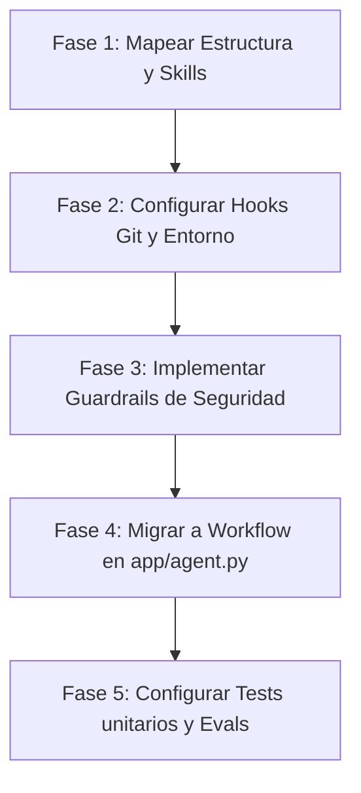

# Plan de Implementación: Migración de Bondy a google-adk 2.0 y agents-cli

Este documento detalla el plan para migrar el proyecto de auditoría de accesibilidad **Bondy** a la estructura nativa basada en **google-adk 2.0** y **agents-cli**, desplazando la seguridad a la izquierda y estableciendo un flujo TDD (Test-Driven Development) automatizado.

---

## 1. Mapeo y Reutilización de Código Previo

| Módulo en `Bondy/` (Origen) | Destino en el Proyecto Principal | Utilidad y Cambios Requeridos |
|---|---|---|
| `.agents/skills/*` | `.agents/skills/*` | **Mantener intacto:** Las 9 skills locales determinísticas y basadas en LLM (Jinja/Python/Vision) son compatibles. |
| `browser/runner.py` | `app/app_utils/security.py` | **Refactorizar:** Extraer `validar_input_antes_de_auditar` como guardrail determinístico previo a la ejecución del Grafo en el Workflow. |
| `mcp_server/github_server.py` | `mcp_server/github_server.py` | **Mantener:** Servidor MCP que expone la lectura del repositorio de GitHub para que el Auditor lo consulte mediante un `McpToolset`. |
| `agents/auditor.py` | `app/agent.py` (Sección Auditor) | **Migrar a ADK 2.0:** Reemplazar la invocación manual del mock de `Agent` por la instanciación de `LlmAgent` de `google.adk.agents` y cargar sus skills locales con un `SkillToolset`. |
| `agents/refactorizador.py` | `app/agent.py` (Sección Refactorizador) | **Migrar a ADK 2.0:** Definir el Refactorizador como un `LlmAgent` secundario especializado con la skill de generación de fixes. |
| `agents/orchestrator.py` | `app/agent.py` (Sección Workflow) | **Migrar a Grafo:** Reemplazar la orquestación síncrona manual de Python por un `Workflow` que conecte el `Auditor` -> `Refactorizador` propagando el estado/hallazgos. |

---

## 2. Automatización del Entorno y Hooks de Git

Para asegurar la calidad del código antes de enviar commits al repositorio local, configuraremos hooks de confirmación:

1. **Creación del Hook `pre-commit`**:
   Crearemos un script de bash/powershell en `.git/hooks/pre-commit` que ejecute automáticamente:
   * `agents-cli lint` (Validación de calidad y tipado con ruff/ty).
   * Pruebas rápidas de seguridad locales.
2. **Setup de Semgrep**:
   Si el entorno lo soporta, configuraremos una tarea de análisis estático rápido de seguridad para prevenir vulnerabilidades OWASP comunes en Python.

---

## 3. Pruebas de Seguridad y TDD (Pytest)

Configuraremos pruebas unitarias e integrales en `tests/` para evaluar la resiliencia del agente frente a fallos y ataques:

* **Tests Determinísticos de Skills:** Validar que las 5 skills sin LLM (idioma, contraste, labels, interactivos, trampa de foco) retornan los resultados esperados utilizando los `demo_sites/` curados.
* **Test de Sanitización / Prompt Injection:** Validar que el guardrail bloquea URLs maliciosas y sanitiza código HTML inyectado con instrucciones maliciosas antes de pasárselo al LLM de Gemini.
* **Evaluación Automatizada (`agents-cli eval`):** Definir un set inicial en `tests/skills_eval/` que corra sobre las trazas del Auditor para asegurar la calidad de la detección visual (`validar-calidad-alt-text`).

---

## 4. Cronograma de Implementación Secuencial

1. **Paso 1:** Mapear la carpeta de `.agents/skills/` y los `demo_sites/` a la raíz del proyecto.
2. **Paso 2:** Crear la configuración de los hooks automatizados locales en `.git/hooks/`.
3. **Paso 3:** Implementar el validador de seguridad de Playwright y el guardrail pre-LLM en `app/app_utils/security.py`.
4. **Paso 4:** Codificar el Grafo en `app/agent.py` utilizando la API de `Workflow` de `google-adk`.
5. **Paso 5:** Escribir los tests automatizados de Pytest.
