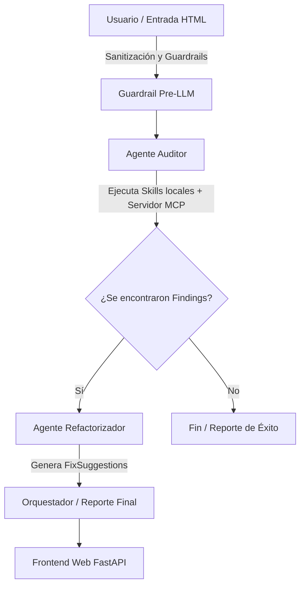

# Bondy — Documento de Diseño y Plan de Implementación

Este documento unifica y centraliza la visión del proyecto, el modelado de amenazas, las especificaciones de accesibilidad WCAG y el flujo de desarrollo secuencial para **A11y-Forge** utilizando **google-adk 2.0** y **agents-cli**.

---

## 1. El Problema y Justificación de Alcance

Las auditorías manuales de accesibilidad (WCAG 2.2 AA) son lentas, y los analizadores estáticos (Lighthouses, Linters) solo validan la presencia de atributos (ej. ¿hay alt?), mas no su semántica o calidad. 

A11y-Forge se enfoca en resolver las **6 categorías que representan el 96% de los errores reales** en el millón de páginas más importantes de la web según el reporte **WebAIM Million 2026**:

| Categoría WebAIM Million | % de Páginas | Skill que lo Cubre | Tipo de Skill | Criterio WCAG |
|---|---|---|---|---|
| Low Contrast Text | 83.9% | `validar-contraste-texto` | Determinística (DOM/Fórmula) | 1.4.3 |
| Missing Alt Text | 53.1% | `validar-calidad-alt-text` | Gemini Vision | 1.1.1 |
| Missing Labels | 51.0% | `validar-labels-formularios` | Determinística (DOM) | 1.3.1 / 4.1.2 |
| Empty Links | 46.3% | `validar-nombre-accesible-interactivo` | Determinística (DOM) | 2.4.4 / 4.1.2 |
| Empty Buttons | 30.6% | `validar-nombre-accesible-interactivo` | Determinística (DOM) | 2.4.4 / 4.1.2 |
| Missing Language | 13.5% | `validar-idioma-documento` | Determinística (DOM) | 3.1.1 |

Adicionalmente, se incluyen 3 skills dinámicas críticas:
* `evaluar-orden-foco` (Determinística - Playwright) [2.4.3]
* `detectar-trampa-de-foco` (Determinística - Playwright) [2.1.2]
* `clasificar-imagen-decorativa` (Gemini Vision) [1.1.1]
* `generar-fix-sugerido` (Gemini Text/Refactorizador) [N/A]

---

## 2. Arquitectura Multiagente Basada en Workflow (ADK 2.0)

A diferencia de los scripts secuenciales en Python plano, implementaremos un flujo de trabajo formal utilizando la API de grafos de **ADK 2.0**:



### Contrato de Datos Comunes

```yaml
Finding:
  id: string (uuid)
  skill: string
  wcag_criterion: string
  severity: enum[critical, warning, info]
  selector: string
  description: string
  evidence:
    current_value: string
    expected_value: string | null

FixSuggestion:
  finding_id: string
  before: string
  after: string
  explanation: string
```

---

## 3. Seguridad y Guardrails (Desplazamiento a la Izquierda)

En concordancia con los principios de desarrollo seguro del codelab, el proyecto implementará tres niveles de control:

1. **Guardrail de Ruta e Entrada determinística (`app/app_utils/security.py`):**
   Antes de instanciar Playwright, se evaluará la fuente de entrada. El agente tiene terminantemente prohibido acceder a URLs arbitrarias externas para evitar SSRF o ejecución de JS no controlado. Solo se permitirá:
   * Sitios web de pruebas locales estructurados en `demo_sites/` (`site_1_bad_alt`, `site_2_focus_trap`, `site_3_mixed_errors`).
   * HTML estático pegado directamente por el usuario (sanitizado previamente).
2. **Control de Privilegios del Servidor MCP (`mcp_server/github_server.py`):**
   El servidor MCP que lee repositorios de GitHub funciona exclusivamente con llamadas de solo lectura (`read_file` y `list_html_files`) respaldado por un token personal *fine-grained* de mínimo privilegio.
3. **Commit Guardrails (Hooks de Git):**
   Configuración de un hook de `pre-commit` en `.git/hooks/pre-commit` que ejecute de forma obligatoria `agents-cli lint` y validaciones previas al commit.

---

## 4. Plan de Implementación de la Migración

El desarrollo del MVP de 17 días se completará siguiendo estos pasos sin bifurcaciones paralelas:

- [x] **Fase 1: Mapeo de Skills y Sitios de Prueba**
  * Copiar las 9 skills del proyecto previo (`Bondy/.agents/skills/*`) hacia `.agents/skills/*`.
  * Copiar los sitios demo (`Bondy/demo_sites/*`) a la raíz del espacio de trabajo.
- [ ] **Fase 2: Configuración del Entorno Seguro**
  * Sincronizar el entorno de desarrollo con `uv sync`.
  * Instalar binarios de Playwright localmente: `uv run playwright install --with-deps chromium`.
  * Crear el script de hook de Git `pre-commit` en la carpeta local de control de versiones.
- [ ] **Fase 3: Implementación del Módulo de Seguridad**
  * Escribir el hook de seguridad de validación en `app/app_utils/security.py` para aislar las llamadas al navegador de Playwright.
- [ ] **Fase 4: Grafo del Workflow en `app/agent.py`**
  * Definir al Auditor y al Refactorizador como `LlmAgent` de ADK.
  * Cablear la orquestación a través de la API `Workflow` del SDK (conectando el estado de salida `Finding[]` a las sugerencias de fixes).
- [ ] **Fase 5: Servidor MCP e Interfaz FastAPI**
  * Ubicar el código del servidor de lectura de GitHub en `mcp_server/github_server.py`.
  * Desarrollar el endpoint web en `app/fast_api_app.py` que permita auditar un sitio demo o pegar un HTML y despliegue el reporte final.
- [ ] **Fase 6: Evaluaciones y Pruebas Unitarias**
  * Escribir tests de Pytest bajo `tests/` para verificar el correcto funcionamiento del validador de inyecciones y de las skills determinísticas.
  * Configurar `eval_config.yaml` y correr `agents-cli eval run` para calibrar el grading.
