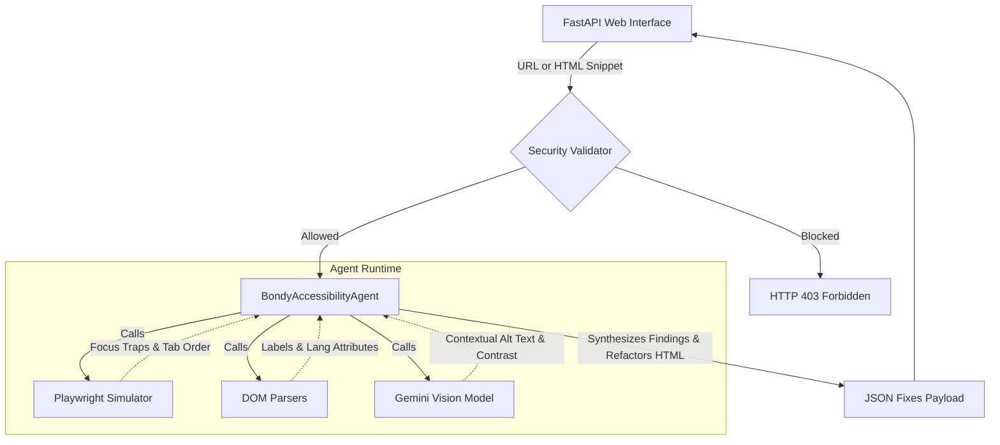

# Bondy — Technical Architecture & Design Specification

This document unifies the project vision, threat modeling, accessibility specifications (WCAG 2.2 AA), and the multi-agent system architecture for **Bondy** using **google-adk 2.0** and **agents-cli**.

---

## 1. Problem Statement & WebAIM Million Justification

Manual accessibility audits (WCAG 2.2 AA) are resource-intensive, and static code analyzers (Lighthouses, linters) only check for the presence of attributes (e.g., "does an alt attribute exist?") rather than their quality or semantic correctness.

Bondy targets the **6 main error categories representing 96% of actual accessibility issues** on the web, based on the **WebAIM Million 2026** report:

| WebAIM Million Category | % of Pages | Responsible Agent Skill | Skill Type | WCAG Criterion |
| :--- | :--- | :--- | :--- | :--- |
| Low Contrast Text | 83.9% | `text-contrast-calculator` | Deterministic (DOM/Math Formula) | 1.4.3 |
| Missing Alt Text | 53.1% | `alt-text-quality-analyzer` | Gemini Multimodal Vision | 1.1.1 |
| Missing Labels | 51.0% | `form-labels-validator` | Deterministic (DOM Parsing) | 1.3.1 / 4.1.2 |
| Empty Links | 46.3% | `interactive-elements-validator` | Deterministic (DOM Parsing) | 2.4.4 / 4.1.2 |
| Empty Buttons | 30.6% | `interactive-elements-validator` | Deterministic (DOM Parsing) | 2.4.4 / 4.1.2 |
| Missing Language | 13.5% | `document-language-validator` | Deterministic (DOM Parsing) | 3.1.1 |

Additionally, Bondy implements three crucial dynamic checking skills:
* `focus-order-validator` (Deterministic - Playwright) [2.4.3]
* `focus-trap-detector` (Deterministic - Playwright) [2.1.2]
* `image-decorator-classifier` (Gemini Multimodal Vision) [1.1.1]
* `suggestion-fix-generator` (Gemini Text Refactoring) [N/A]

---

## 2. Agent Architecture (ADK 2.0)

To avoid Vertex AI rate limits (429 RESOURCE_EXHAUSTED) caused by concurrent subagents, the architecture was simplified and optimized into a **single LlmAgent** design. 

The `BondyAccessibilityAgent` acts as a monolithic orchestrator equipped with a robust `SkillToolset`. It sequentially evaluates the input source and executes its toolkit.



### Specialized Skills & Responsibilities
Instead of separate agents, the single agent has access to these deterministic and LLM-based skills:
* **Image Skills**: Audits images and alt-text quality (WCAG 1.1.1).
* **Form Skills**: Validates form input labels (WCAG 1.3.1 / 4.1.2).
* **Keyboard Skills**: Checks keyboard accessibility, focus traps, and logical tab sequences (WCAG 2.1.2 / 2.4.3).
* **Document Skills**: Handles document language, contrast ratios, and accessible names on links/buttons (WCAG 1.4.3 / 3.1.1 / 2.4.4).

### Common Data Contract Specifications

```yaml
Finding:
  id: string (uuid)
  skill: string
  wcag_criterion: string
  severity: enum[critical, warning, info]
  selector: string
  description: string
  evidence:
    current_value: string
    expected_value: string | null

FixSuggestion:
  finding_id: string
  before: string
  after: string
  explanation: string
```

---

## 3. Left-Shift Security & Guardrails

To meet secure coding standards, the project implements three layers of control:

1. **Deterministic Path and Input Guardrail (`app/app_utils/security.py`):**
   Before launching Playwright browser instances, the input source is evaluated. The agent is restricted from navigating to arbitrary external URLs. It only allows:
   * Pre-registered local demo sites under `demo_sites/`.
   * Statically sanitized raw HTML inputs directly pasted by the user.
2. **Fine-Grained MCP Privileges (`mcp_server/github_server.py`):**
   The GitHub reader Model Context Protocol server uses read-only calls (`read_github_file` and `list_github_directory`) authorized under a minimal fine-grained personal access token.
3. **Commit Guardrails (Git Hooks):**
   Enforces static code analysis checks locally before any commit occurs via Git pre-commit hooks executing `ruff` formatting and linters.

---

## 4. Development Checklist

For details on implementation phases, tasks, and migration progress, please refer directly to the [IMPLEMENTATION_PLAN.md](../IMPLEMENTATION_PLAN.md) file.
